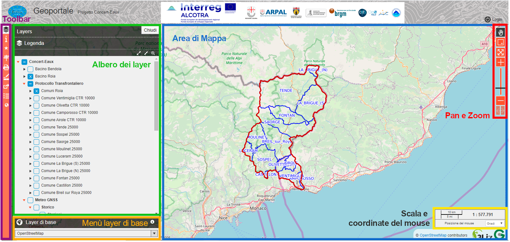

Il Geoportale Concert-Eaux
==================================

L'interfaccia grafica
--------------------------------------------

Il geoportale Concert-Eaux è raggiungibile a questo link: https://www.gishosting.gter.it/lizmap-web-client/lizmap/www/index.php/view/map/?repository=concerteaux&project=concerteaux

Linterfaccia del Geoportale, intuitiva e user-friendly, è composta da:

* **Area di Mappa** qui vengono visualizzati i dati
* **Albero dei Layer** qui sono elencati tutti i layer disponibili sul Geoportale. I dati derivanti, dal progetto Concert-Eaux e da progetti precedenti, sono suddivisi in quattro gruppi principali, uno per progetto, nominati appunto Concert-Eaux, EurEauPa, RiskNat e Eurobassin. Questi quattro gruppi sono al loro volta suddivisi in sottogruppi. I singoli layers e sottogruppi possono essere accesi e spenti cliccando sul checkbox corrispondente. Cliccando invece sulla freccia accanto alla checkbox è possibile espandere il gruppo e visualizzarne quindi il contenuto oppure, nel caso dei layer, visualizzarne la legenda. Inoltre cliccando sul nome del gruppo o del layer è pissibile accedere a un popup contenete eventuali informazioni, modificarne l'opacità, zoommare all'estensione del layer e se possibile scaricare il dato.
* **Menù dei layer di base** qui sono elencati tutti gli sfondi cartografici disponibili per il geoportale. Di defult viene caricato lo sfonod i OpenStreetMap.
* **Toolbar** da qui è possibile accedere a tutti gli strumenti disponibili (metadati, editing per i soli utenti accreditati, selezione, localizzazione, stampa, misura, permalink, tabelle degli attributi, visualizzatore 3D). I singoli strumenti saranno meglio descritti nella sezione :ref:`strumenti-e-funzioni`.
* **Pane Zoom** strumenti per la navigazione dell'area di mappa (sposta, zoom con rettangolo, zoom alla massima estenzione, zoom-in e zoom-out, zoom precedente e successivo).
* **Scala e Coordinate del mouse** qui vengono mostrate la scala di visualizzazione e le coordinate al puntatore del mouse espresse.

Il pulsante **Login** in alto a destra nell'header, consente appunto all'utente di accreditarsi con il proprio user e password. A seconda dei privilegi attribuiti ai singoli utenti dall'amministratore del Geoportale, l'utente potra accedere a strumenti e funzioni che altrimenti non sono visibili come il download o l'editing dei dati.

.. _strumenti-e-funzioni:

Strumenti e funzioni
--------------------------------------------

