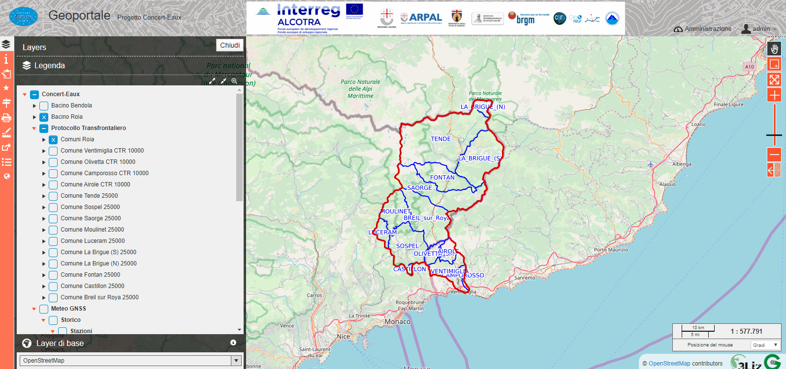

Il Geoportale Concert-Eaux
==================================

L'interfaccia grafica
--------------------------------------------

Il geoportale Concert-Eaux è raggiungibile a questo link: https://www.gishosting.gter.it/lizmap-web-client/lizmap/www/index.php/view/map/?repository=concerteaux&project=concerteaux

.. image:: img/interfaccia.png

Linterfaccia del Geoportale, intuitiva e user-friendly, è composta da:

* **Area di Mappa** qui vengono visualizzati i dati
* **Albero dei Layer** qui sono elencati tutti i layer disponibili sul Geoportale. I dati derivanti, dal progetto Concert-Eaux e da progetti precedenti, sono suddivisi in quattro gruppi principali, uno per progetto, nominati appunto Concert-Eaux, EurEauPa, RiskNat e Eurobassin. Questi quattro gruppi sono al loro volta suddivisi in sottogruppi. I singoli layers e sottogruppi possono essere accesi e spenti cliccando sul checkbox corrispondente. Cliccando invece sulla freccia accanto alla checkbox è possibile espandere il gruppo e visualizzarne quindi il contenuto oppure, nel caso dei layer, visualizzarne la legenda. Inoltre cliccando sul nome del gruppo o del layer è pissibile accedere a un popup contenete eventuali informazioni, modificarne l'opacità, zoommare all'estensione del layer e se possibile scaricare il dato.

* **Menù dei layer di base** qui sono elencati tutti gli sfondi cartografici disponibili per il geoportale. Di defult viene caricato lo sfondo di OpenStreetMap.

* **Toolbar** da qui è possibile accedere a tutti gli strumenti disponibili (metadati, editing per i soli utenti accreditati, selezione, localizzazione, stampa, misura, permalink, tabelle degli attributi, visualizzatore 3D). I singoli strumenti saranno meglio descritti nella sezione :ref:`strumenti-e-funzioni`.

.. image:: img/tool.gif

* **Pan e Zoom** strumenti per la navigazione dell'area di mappa (sposta, zoom con rettangolo, zoom alla massima estenzione, zoom-in e zoom-out, zoom precedente e successivo).
* **Scala e Coordinate del mouse** qui vengono mostrate la scala di visualizzazione e le coordinate al puntatore del mouse espresse.

Il pulsante **Login** in alto a destra nell'header, consente appunto all'utente di accreditarsi con il proprio user e password. A seconda dei privilegi attribuiti ai singoli utenti dall'amministratore del Geoportale, l'utente potra accedere a strumenti e funzioni che altrimenti non sono visibili come il download o l'editing dei dati.

.. _strumenti-e-funzioni:

Strumenti e funzioni
--------------------------------------------

Modifica
+++++++++
Lo strumento **Modifica** compare nella toolbar solo se l'utente ha eseguito il login e se gli sono stati attribuiti i permessi per la modifica dei dati. Lo strumento consente di:

* creare nuovi elementi (sia la geometria che le relative informazioni alfanumeriche),
* modificare le geometrie e/o le relative informazioni alfanumeriche
* eliminare le geometrie esistenti

Per creare nuovi elementi è sufficiente cliccare sul bottone dello strumento **Modifica** nella toolbar, disegnare la geometria nell'area di mappa e inserire le varie informazioni nella tabella. **Attenzione** i campi della tabella, contrassegnati da un asterisco rosso, sono obbligatori ciò significa che è necessario inserire delle informazioni affinche il nuovo elemento sia correttamente salvato

Per modificare un elemento esistente invece, è ncessario interrogare l'elemento desiderato cliccando con il mouse e si aprirà il pop-up con l'elenco delle informazioni associate all'elemento. Nel pop-up è presente una toolbar, selezionando lo strumento modifica da qui è possibile accedere e quindi modificare le informazioni associate o la geometria. Allo stesso modo è possibile accedere allo strumento di modifica delle informazioni tramite lo strumento **Dati**. Ovviamente è possibile anche modificare la geometria semplicemente attivando la modifica e *trascinando* nella posizione desiderata il punto o, in caso di linee e poligoni, i singoli vertici.

Per eliminare invece un elemento esistente, il procedimento è simile a quello della modifica. Bisogna infatti accedere allo strumento modifica presente nella toolbar del pop-up che compare interrogando l'elemento di interesse e andare a inserire la data in corrispondenza del campo **data_eliminazione**.

In ogni caso per rendere effettiva qualsiasi modifica ai dati (creazione di nuovi elementi, modifica o eliminazione degli esistenti) è necessario premere il pulsante *Salva*. ATTENZIONE: una volta salvate le modifiche non sarà più possibile tornare indietro.

.. image:: img/modifica.gif

Per maggiori dettagli si rimanda al manuale di Lizmap Web Client https://docs.lizmap.com/current/it/user/user_guide.html#editing-spatial-data

Selezione
++++++++++
Lo strumento **Selezione** permette di selezionare le geometrie di un layer a sua volta selezionato tramite il menù a tendina dello strumento. Gli strumenti di selezione disponibili sono:

* selezione tramite riquadro
* slezione tramite cerchio
* selezione tramite poligono
* selezione tramite disegno a mano libera

E' possibile creare una nuova selezione, aggiungere gli elementi selezionati alla selezione esistente oppure rimuovere gli elementi selezionati dalla selezione esistente. Inoltre è possibile deselezionare tutti gli elementi slezionati oppure filtrare gli elementi selezionati. Con il filtro resteranno visibili nell'area di mappa solo gli elementi precedentemente selezionati. ovviamente è possibile rimuovere il filtro per visualizzare nuovamente tutte le geometrie.

.. image:: img/selezione.gif

Localizzazione
+++++++++++++++
Lo strumento **Localizzazione** permette di cercare e selezionare un comune facente parte del bacino del Roia. Una volta selezionato, l'area di mappa viene zoomata e centrata all'estensione del comune. E' sufficiente digitare i primi caratteri del nome del comune per trovarlo all'interno della lista. Altrimenti è possibile aprire il menù a tendina e scorrerlo per trovare il comune di interesse.

.. image:: img/localizzazione.gif

Stampa
+++++++
Lo strumento **Stampa** permette di salvare l'area di mappa in formato immagine (pdf, jpg, ecc.). Al momento sono disponibili 4 layout di stampa (A4 orizzontale e verticale, A3 orizzontale e verticale) da scegliere nel relativo menù a tendina dello strumento. E' possibile definire la scala di stampa da scegliere dal relativo menù a tendina e la risoluzione dell'immagine. Sono disponibili diversi formati file (PDF, JPG, PNG e SVG). Una volta attivato lo strumento, comparirà nell'area di mappa un riquadro rosso la cui forma e dimensione cambierà a seconda del layout e dalla scala scelta per la stampa. E' sufficiente spostare il riquadro per inquadrare la porzione di mappa che si vuole stampare. nella stampa compariranno tutti i layer che sono stati accesi nell'albero dei layer e lo sfondo cartografico scelto.

.. image:: img/stampa.gif

Misura
++++++++
Lo strumento **Misura** permette di misurare:

* una lunghezza
* un'area
* un perimetro

E' sufficiente selezionare il tipo di misura che si vuole fare dal menù a tendina e iniziare a disegnare sull'area di mappa la lunghezza/l'area/ il perimetro che si vuole misurare. Un click del tastro destro del mouse aggiunge un unovo nodo al tracciato della misura, doppio click con il tasto destro del mouse per chiudere il tracciato e quindi interrompere la misura. E' possibile passare da un tipo di misura all'altro semplicemente selezionando quello desiderato dal menù a tendina senza dover chiudere e riaprire lo strumento.

.. image:: img/misura.gif

Dati
++++++
Lo strumento **Dati** permette di visualizzare in un pannello, che viene aperto automaticamente in basso cliccando sul pulsante nella toolbar laterale, la tabella degli attributi associata alle geometrie dei vari layer pubblicati nel geoportale. All'apertura, il pannello mostra l'elenco dei layer per i quali è possibile visualizzare la tabella. E' sufficiente premere sul pulsante *Dettaglio* corrispondente al layer desiderato per visualizzare la tabella. 

Una volta aperta la tabella degli attributi, è possibile agire sulle singole righe tramite i pulsanti in corrispondenza di ciascuna riga. Questi tool permettono di:

* selezionare la riga e quindi la geometria corrispondente, 
* zoomare sulla geometria, 
* centrare l'area di mappa sulla geometria ,
* modificare le informazioni alfanumeriche presenti in tabella (solo se l'utente loggato è abilitato alla modifica dei dati)

E' possibile inoltre filtrare le righe mostrate in tabella digitando ad esempio una parola chiave o anche solo alcuni caratteri nel form *Cerca*. Saranno quindi mostrate solo le righe che rispondono al criterio di ricerca. Per tornare alla visualizzazione totale delle righe è sufficiente cancellare il contenuto dal form *Cerca*. Una volta filtrate le righe secondo un criterio di interesse, tutte le geometrie sono comunque visibili nell'area di mappa mentre saranno visualizzate solo le righe della tabella che rispondono al criterio di ricerca.

Gli strumenti accanto al form *Cerca* permettono di:

* selezionare tutte le righe, 
* deselezionare le righe selezionate, 
* spostare le righe selezionate in cima alla tabella
* filtrare i dati (con questo strumento verranno temporaneamente visualizzate solo le geometrie e le corrispondenti righe in tabella che rispondono al criterio di ricerca. Per tornare alla visualizzazione totale è sufficiente cliccare nuovamente sul pulsante del filto),
* visualizzare i valori della tabella.

.. image:: img/dati.gif

Per maggiori dettagli si rimanda al manuale di Lizmap Web Client https://docs.lizmap.com/current/it/user/user_guide.html#attribute-layers

3D
++++
Lo strumento **3D** permette di visualizzare alcuni dati pubblicati nel geoportale in un modello tridimensionale basato sul Modello Digitale del terreno del Bacino del Roia. Si tratta di un visualizzatore 3D integrato dotato di propri strumenti come ad esempio un albero dei layer da cui è possibile accendere/spegnere i singoli layer e modificarne l'opacità. Inoltre è possibile interrogare le singole features nel modello 3D semplicemente cliccandoci sopra con il mouse. Il modello è navigabile attraverso il mouse:

* tenendo premuto il tasto sinistro si ha il tool *orbita*
* tenendo premuto il tasto destro si ha il tool *pan*
* muovendo la rotella si ha il tool *zoom*

.. image:: img/treD.gif

Il pannello in basso in cui viene visualizzato il modello 3D può essere ingrandito cliccando sul tasto *Massimizza*, oppure mantenuto aperto cliccando il tasto *Fissa* oppure chiuso cliccando sul tasto *Chiudi* nella barra degli strumenti in basso nel pannello oppure cliccando nuovamente il pulsante sulla toolbar laterale del geoportale.

Manuale
+++++++
Lo strumento **Manuale** apre in una nuova pagina del browser la pagina wed di questo manuale.

